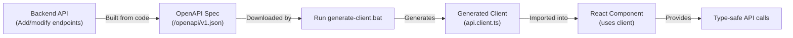

# API Client Generation

Automated TypeScript/React client generation from OpenAPI specifications using NSwag.

## 📚 Documentation

- **[Quick Reference](./QUICK_REFERENCE.md)** - Quick commands and common tasks
- **[Full Guide](./OPENAPI_GENERATION_GUIDE.md)** - Comprehensive guide with examples
- **Generated Client** - See `../generated/react/src/api/`

## Overview

This directory contains tools and configuration for automatically generating type-safe API clients from your .NET backend's OpenAPI specification. The generated client provides:

- ✅ **Type-safe** API calls
- ✅ **Auto-complete** in IDEs
- ✅ **Async/await** support
- ✅ **Error handling** with custom exception types
- ✅ **Request/response** interceptors
- ✅ **Automatic** documentation from OpenAPI

## Quick Start - React

### Windows

```bash
cd clients/generation
.\generate-react-client.bat
```

### macOS/Linux

```bash
cd clients/generation
chmod +x generate-react-client.sh
./generate-react-client.sh
```

### From React Project

```bash
cd frontend/React/template
npm run generate:client
```

## Generated Files

After generation, find your client here:

- **Generated Types & Client:** `clients/generated/react/src/api/generated.ts`
- **Export Barrel:** `clients/generated/react/src/api/index.ts`
- **Adapter Wrapper:** `frontend/React/template/src/api/client-adapter.ts`

## Prerequisites

### Required

- **Node.js 18+** - JavaScript runtime
- **.NET 10 SDK** - Backend compilation
- **NSwag CLI** - OpenAPI client generation

### Installation

```bash
# Install NSwag globally (recommended)
npm install -g @nswag/cli

# Or install locally in this folder
cd clients/generation
npm install
```

## Configuration

### `openapi-generator-config.json`

Main configuration file for client generation:

```json
{
  "runtime": "Net80",
  "documentGenerator": {
    "fromDocument": {
      "url": "http://localhost:5000/openapi/v1.json",
      "output": null
    }
  },
  "codeGenerators": {
    "openApiToTypeScriptClient": {
      "className": "TodoApiClient",
      "moduleName": "TodoApiClient",
      "typeScriptVersion": 5.0,
      "output": null
    }
  }
}
```

### Key Settings

| Setting             | Value                                   | Purpose                      |
| ------------------- | --------------------------------------- | ---------------------------- |
| `url`               | `http://localhost:5000/openapi/v1.json` | OpenAPI spec endpoint        |
| `className`         | `TodoApiClient`                         | Generated class name         |
| `typeScriptVersion` | `5.0`                                   | TypeScript version to target |
| `output`            | Auto-set by script                      | Output file path             |

## Usage

### Basic Generation

```bash
# With default settings (localhost:5000)
.\generate-client.bat

# Or specify custom API endpoint
.\generate-client.bat http://api.example.com
```

### Advanced Options

```bash
# Generate from specific backend project
.\generate-client.bat http://localhost:5000 ..\..\backend\.NET\template

# With custom configuration
nswag run openapi-generator-config.json /input:custom-spec.json
```

## Generated Client Structure

The generated client includes:

```typescript
// api.client.ts (auto-generated)

export class TodoApiClient {
  // Constructor with HTTP client
  constructor(baseUrl?: string, http?: HttpClient) { }

  // Generated methods from API endpoints
  getTodos(page: number, pageSize: number): Promise<PaginatedTodosDto> { }
  getTodoById(id: string): Promise<TodoDto> { }
  createTodo(command: CreateTodoCommand): Promise<TodoDto> { }
  updateTodo(id: string, command: UpdateTodoCommand): Promise<TodoDto> { }
  deleteTodo(id: string): Promise<void> { }
}

// Auto-generated DTOs
export interface TodoDto {
  id: string;
  title: string;
  description?: string;
  completed: boolean;
  createdAt: Date;
  completedAt?: Date;
}

export interface CreateTodoCommand {
  title: string;
  description?: string;
}
```

## Integration with React

### 1. Place Generated Client

```bash
# Copy generated client to React project
cp ../generated/api.client.ts ../../frontend/React/src/api/generated/
```

### 2. Create API Service

Create `src/api/client.ts`:

```typescript
import { TodoApiClient } from './generated/api.client'

// Initialize client with base URL
export const apiClient = new TodoApiClient(
  import.meta.env.VITE_API_URL || 'http://localhost:5000',
  // Pass your HTTP client instance if needed
)

// Export for use in components
export { TodoApiClient }
```

### 3. Use in Components

```typescript
import { apiClient } from '@/api/client'

export function TodoList() {
  const [todos, setTodos] = useState<TodoDto[]>([])
  const [loading, setLoading] = useState(true)

  useEffect(() => {
    const fetchTodos = async () => {
      try {
        const result = await apiClient.getTodos(1, 10)
        setTodos(result.items)
      } catch (error) {
        console.error('Failed to fetch todos:', error)
      } finally {
        setLoading(false)
      }
    }

    fetchTodos()
  }, [])

  if (loading) return <div>Loading...</div>
  return (
    <ul>
      {todos.map(todo => (
        <li key={todo.id}>{todo.title}</li>
      ))}
    </ul>
  )
}
```

### 4. Use with TanStack Query (Recommended)

```typescript
import { useQuery, useMutation } from '@tanstack/react-query'
import { apiClient } from '@/api/client'

export function useTodos() {
  return useQuery({
    queryKey: ['todos'],
    queryFn: () => apiClient.getTodos(1, 10),
  })
}

export function useCreateTodo() {
  const queryClient = useQueryClient()

  return useMutation({
    mutationFn: (command: CreateTodoCommand) =>
      apiClient.createTodo(command),
    onSuccess: () => {
      queryClient.invalidateQueries({ queryKey: ['todos'] })
    },
  })
}
```

## Workflow

### Development Workflow



### CI/CD Integration

Add to your GitHub Actions workflow:

```yaml
- name: Generate API Client
  run: |
    cd clients/generation
    ./generate-client.sh http://api-staging.example.com
    cp ../generated/api.client.ts ../../frontend/React/src/api/

- name: Build React App
  run: |
    cd frontend/React
    npm install
    npm run build
```

## Troubleshooting

### Error: "API is not running"

```bash
# Start the backend API in another terminal
cd backend/.NET/template
dotnet run
```

### Error: "NSwag command not found"

```bash
# Install NSwag globally
npm install -g @nswag/cli

# Or use npx
npx @nswag/cli run openapi-generator-config.json
```

### Error: "OpenAPI spec not found"

Ensure the backend API is running and accessible:

```bash
# Test API endpoint
curl http://localhost:5000/openapi/v1.json
```

### Generated client has wrong types

1. Check OpenAPI spec is up-to-date:
   ```bash
   curl http://localhost:5000/openapi/v1.json
   ```

2. Verify endpoint has proper OpenAPI attributes:
   ```csharp
   app.MapGet("/api/todos", GetTodos)
       .WithOpenApi()  // ✅ Required for documentation
       .WithName("GetTodos");
   ```

3. Regenerate client:
   ```bash
   rm ../generated/api.client.ts
   ./generate-client.bat
   ```

## Advanced Configuration

### Custom HTTP Headers

```typescript
// Extend generated client
export class AuthenticatedApiClient extends TodoApiClient {
  constructor(
    private token: string,
    baseUrl?: string,
    http?: HttpClient
  ) {
    super(baseUrl, http)
  }

  // Override requests to add auth header
  protected transformOptions(options: RequestInit): Promise<RequestInit> {
    options.headers = {
      ...options.headers,
      Authorization: `Bearer ${this.token}`,
    }
    return Promise.resolve(options)
  }
}
```

### Custom Request Interceptor

```typescript
// In api.ts
export const apiClient = new TodoApiClient(apiUrl)

// Add global error handling
const originalFetch = window.fetch
window.fetch = async (input, init) => {
  const response = await originalFetch(input, init)

  if (!response.ok && response.status === 401) {
    // Handle unauthorized - redirect to login
    window.location.href = '/login'
  }

  return response
}
```

## Regeneration Strategy

### When to Regenerate

- ✅ After adding new API endpoints
- ✅ After modifying existing endpoint signatures
- ✅ After adding new DTOs
- ✅ Before committing backend changes

### When NOT to Regenerate

- ❌ When only internal endpoint logic changes
- ❌ When only database schema changes (no API change)
- ❌ During active frontend development (avoid conflicts)

### Best Practice

```bash
# Before committing backend changes
cd clients/generation
./generate-client.bat
cd ../..
git add frontend/React/src/api/generated/api.client.ts
git commit -m "Update API client from OpenAPI spec"
```

## Performance Optimization

### Lazy-load client

```typescript
// Only import when needed
const apiClient = lazy(() =>
  import('./generated/api.client').then(m => ({
    default: m.TodoApiClient,
  }))
)
```

### Cache API responses

```typescript
// With TanStack Query
useQuery({
  queryKey: ['todos'],
  queryFn: () => apiClient.getTodos(1, 10),
  staleTime: 5 * 60 * 1000, // 5 minutes
})
```

## Resources

- [NSwag Documentation](https://github.com/RicoSuter/NSwag)
- [OpenAPI Specification](https://spec.openapis.org/)
- [TypeScript Handbook](https://www.typescriptlang.org/docs/)
- [React Query Documentation](https://tanstack.com/query/latest)

## Support

For issues or questions:

1. Check troubleshooting section above
2. Verify backend API is running: `curl http://localhost:5000/health`
3. Review generated OpenAPI spec: `curl http://localhost:5000/openapi/v1.json`
4. Check NSwag configuration in `openapi-generator-config.json`
5. Consult backend team about API changes
