# Angular Architecture Overview

## Project Structure

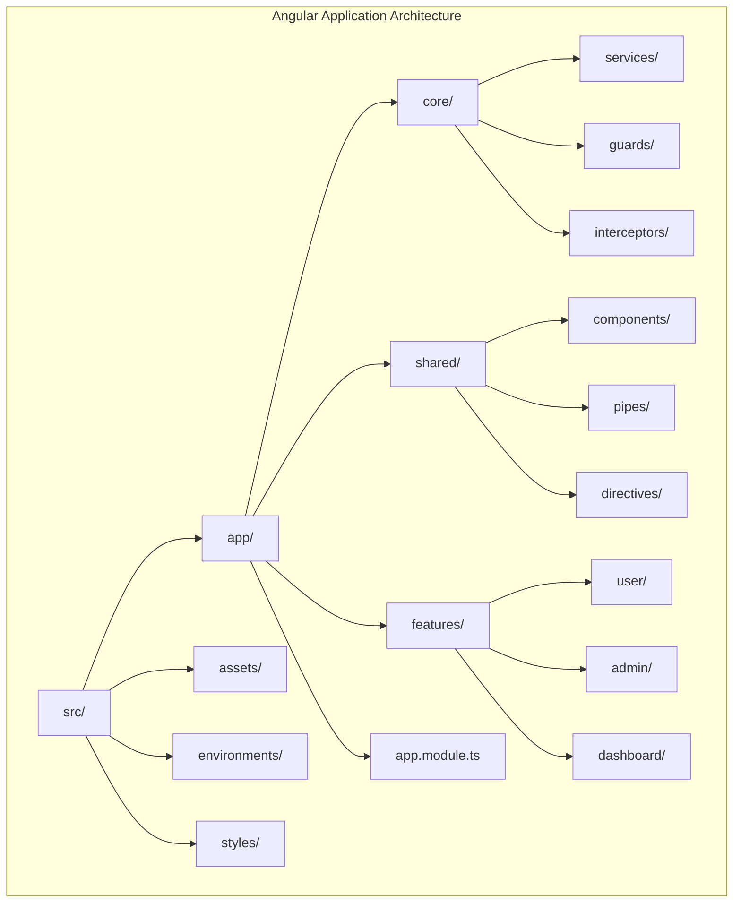

## Folder Structure Explanation

### `/src/app/core`
Singleton services and infrastructure

- **Services**: Authentication, HTTP, User management
- **Guards**: AuthGuard, RoleGuard, CanDeactivate
- **Interceptors**: Token injection, Error handling
- **Only imported in AppModule** - Singleton pattern
- No other modules should import from core

### `/src/app/shared`
Reusable across the application

- **Components**: Header, Footer, Navigation, UI Components
- **Pipes**: Custom pipes (date, currency, etc.)
- **Directives**: Custom directives for common behavior
- **Models/Interfaces**: Shared data structures
- Can be imported by any module

### `/src/app/features`
Feature-specific modules and components

- Each feature in its own folder
- Includes components, services, models
- Separate routing module
- Lazy loaded when possible

### `/src/app/app.module.ts`
Main application module

- Imports core module
- Declares shared module
- Configures routes
- Bootstraps AppComponent

## Data Flow Architecture

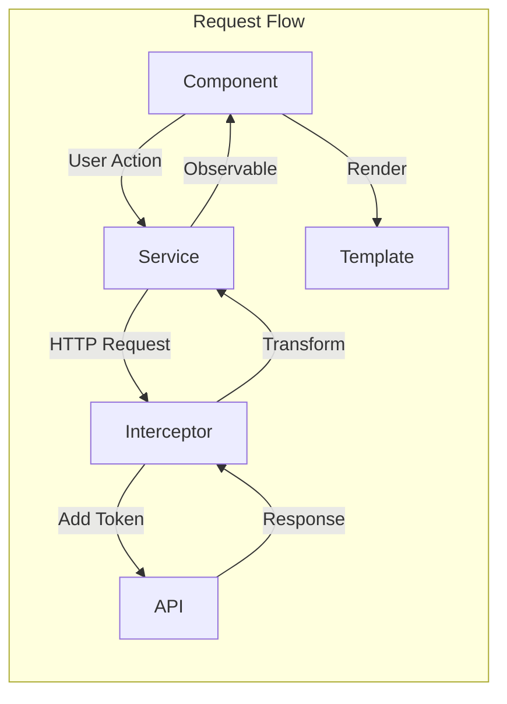

## Component Hierarchy

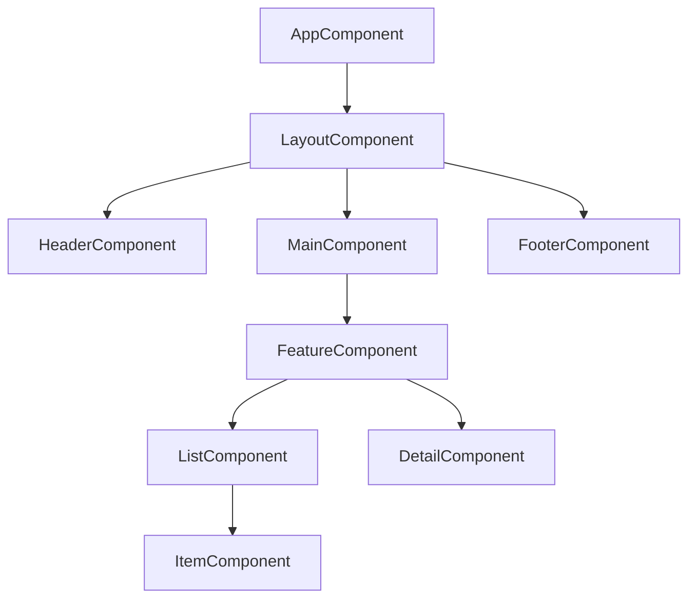

## Service Layer Architecture

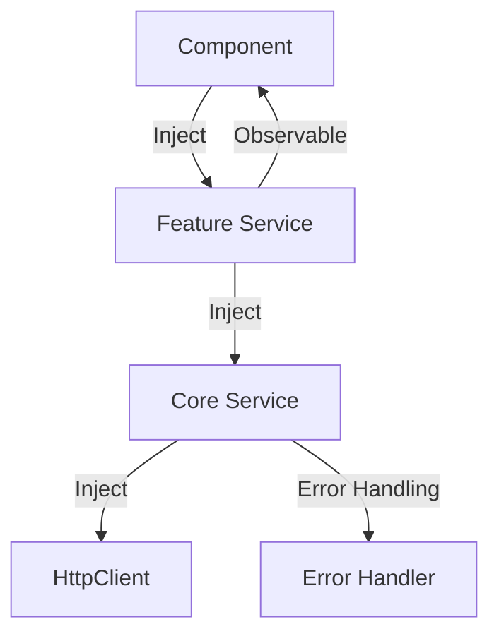

## Module Organization Pattern

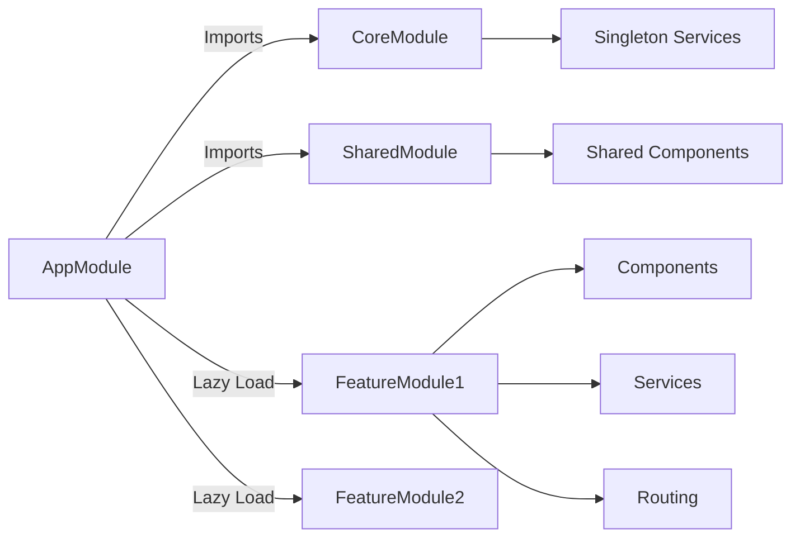

## HTTP Communication Pattern

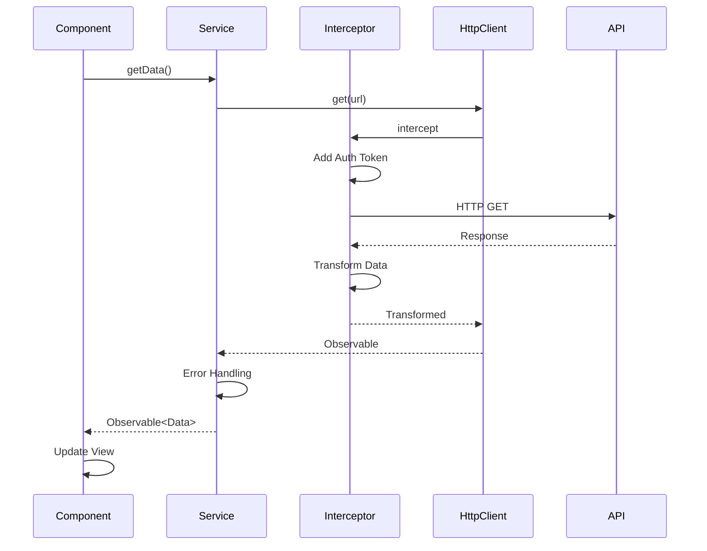

## Reactive Forms Pattern

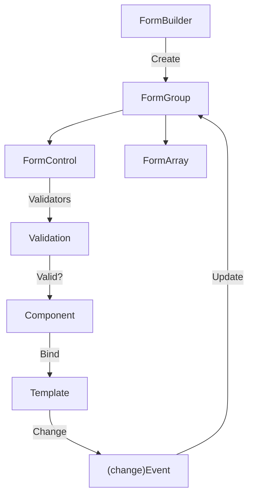

## Change Detection Strategy

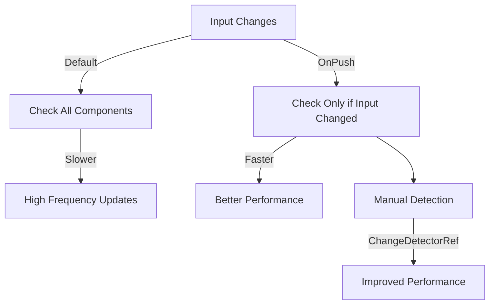

## Lazy Loading Module Flow

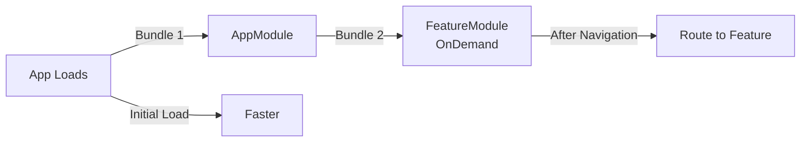

## Error Handling Architecture

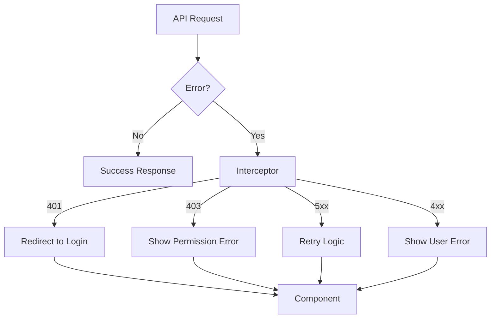

## Folder Structure Example

```
src/
├── app/
│   ├── core/
│   │   ├── services/
│   │   │   ├── auth.service.ts
│   │   │   └── user.service.ts
│   │   ├── guards/
│   │   │   ├── auth.guard.ts
│   │   │   └── admin.guard.ts
│   │   ├── interceptors/
│   │   │   ├── auth.interceptor.ts
│   │   │   └── error.interceptor.ts
│   │   └── core.module.ts
│   │
│   ├── shared/
│   │   ├── components/
│   │   │   ├── header/
│   │   │   └── footer/
│   │   ├── pipes/
│   │   │   └── custom.pipe.ts
│   │   ├── directives/
│   │   │   └── custom.directive.ts
│   │   └── shared.module.ts
│   │
│   ├── features/
│   │   ├── user/
│   │   │   ├── components/
│   │   │   ├── services/
│   │   │   ├── user-routing.module.ts
│   │   │   └── user.module.ts
│   │   │
│   │   └── admin/
│   │       ├── components/
│   │       ├── services/
│   │       ├── admin-routing.module.ts
│   │       └── admin.module.ts
│   │
│   ├── app-routing.module.ts
│   ├── app.component.ts
│   └── app.module.ts
│
└── environments/
    ├── environment.ts
    └── environment.prod.ts
```

## State Management Options

### Simple State (BehaviorSubject)
```mermaid
graph LR
    A["BehaviorSubject<State>"] -->|subscribe| B["Component"]
    C["Service"] -->|next()| A
    B -->|Action| C
```

### Complex State (NgRx)
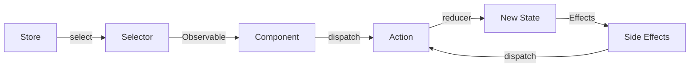

## Best Practices Summary

1. **Separation of Concerns**
   - Components: Presentation only
   - Services: Business logic
   - Guards: Route protection
   - Interceptors: HTTP concerns

2. **Type Safety**
   - Strong TypeScript typing
   - Interfaces for all data
   - Avoid `any` type

3. **Reactive Programming**
   - Use Observables throughout
   - Proper subscription management
   - RxJS operators for composition

4. **Performance**
   - OnPush change detection
   - Lazy loading modules
   - Async pipe in templates
   - Unsubscribe in ngOnDestroy

5. **Testing**
   - Unit tests for all components
   - Mock services and HTTP
   - Test behavior not implementation

## Integration Points

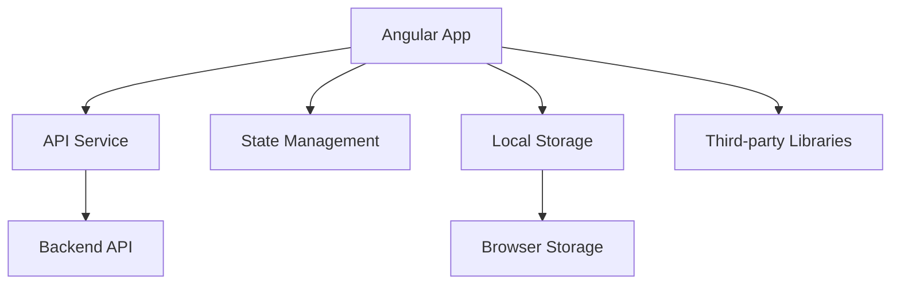
